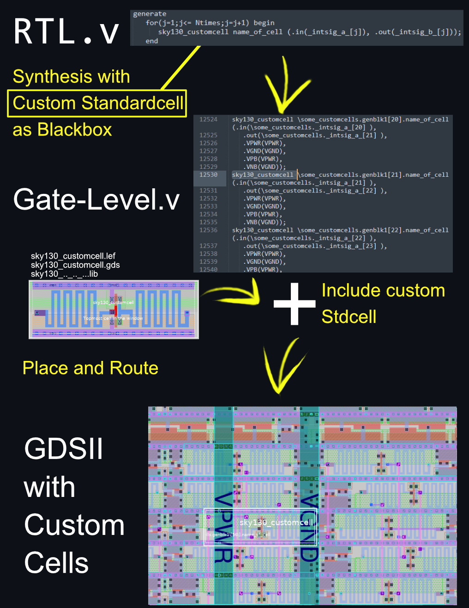
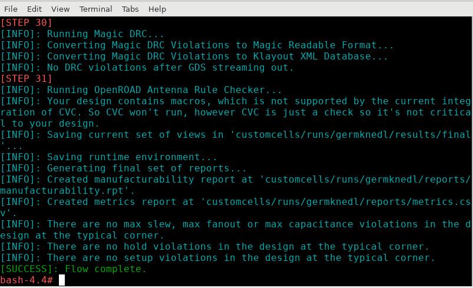

# SKY130 Workflow RTL-with-Custom-Standardcell to GDSII-Macrocell

If you want RTL mixed with predefined standardcells (including custom-cells), synthesized and converted to a GDSII macro while the workflow is not allowed to "optimize" the structure, then this guide is for you. 

This documentation was written using the SKY130 [iic-osic-tools](https://github.com/iic-jku/iic-osic-tools) design environment, and is sponsored by lots of coffee.



## Magic: Design of a custom Standardcell
Making custom standardcells is pretty difficult. You have to make sure that your standard cells boundary-box abuts all other standard cells in all orientations without generating DRC errors. Keep an eye on your logfiles, especially the DRC and Manufacturability-Logs and double-check your results. 

In the end, the standardcell should look somewhat like this. 

   

### Workaround for falsely-expected macros
UPDATE: MPL-0004 has been changed to a warning, which means the workaround should not be needed after an [update of openROAD](https://github.com/The-OpenROAD-Project/OpenROAD/commit/b84718ffe1ac04a0df1697e1e0e7339eb5414de0). 

Openlane expects macros if a lef-file is added to the design, which is false since we are adding a custom standardcell. Macros are handled different to standardcells in terms of placement and power-distribution. Standardcells are placed inside of a horizontal power-grid on Metal1 after the PDN on metal1 and metal4 have been generated and routed. The result is a hardened macro. Macros should therefore already have a vertical PDN on Metal4, they should be connected to the horizontal PDN on Metal5 later. Until an official solution is out, disable `basic_macro_placement` in `/foss/tools/openlane/2022.07/scripts/tcl_commands/floorplan.tcl` as suggested in Slack.

Maybe you need root-access for this workaround. Start the docker-container with user `0` and group `0`. 
If you're using iic-osic-tools, you may edit the start_vnc script.
```
docker run -d --user 0:0 %PARAMS% -v "%DESIGNS%":/foss/designs  %DOCKER_USER%/%DOCKER_IMAGE%:%DOCKER_TAG%
```

### Cell layout
Read first: [Design rules](https://github.com/nickson-jose/vsdstdcelldesign)  

### Port alignment
For Place&Route, all ports should be aligned on the crosssections of a grid. To show the grid for high-density cells (sky130_fd_sc_**hd**__...) type `grid 0.46um 0.34um 0.23um 0.17um` into the magic tcl-console.

### Cell size
Property FIXED_BBOX needs to be set, this value is used to align multiple standardcells next to each other, the bboxes should not overlap in all directions. 

X and Y dimensions must equal multiples of a constant value - [see PDK Documentation](https://antmicro-skywater-pdk-docs.readthedocs.io/en/latest/contents/libraries/foundry-provided.html) for X-Grid and Y-Grid.
For a high-density custom cell the size in micrometers is (N times 0.46)x(8 times 0.34). Scale the result to your magic internal-value (lambda). In my case a multiplication by 200 is needed since the internal lambda-grid is 0.005um, so for h=2.72 and w=9.66um the proper value for my design environment would be `property FIXED_BBOX {0 0 1932 544}`. 

The PDK high density standard cell magic-files are located in `/foss/pdk/sky130A/libs.ref/sky130_fd_sc_hd/mag/..`. You may want to compare them your design.

### Tap connections
Notice that most standard-cells don't have tap connections, instead there is a port "VNB" on pwell and "VPB" on nwell. Instead, the tap connections are placed as Tap-Standardcells with a defined distance (Tap-Distance).

### Placement of Poly Connectors
If you look at other standard cells, you may notice it is good practice to place poly-connectors only in the middle-area of the standardcell.

### Port definition
Select the area where you want a port connection, then `Edit` and `Text..`. 
Enter the name of the port in Text-string, check sticky, uncheck default, enter the layer where the port should be (li, metal1, etc.), size to 0.1um, check Port enable, and choose connection orientations (n s e w center ...).

The router needs to know some additional properties of your ports. Set the following properties in the magic tcl-console for each port:

VPWR and VPB (pmos Bias):
```
port use power
port class inout
port shape abutment
```

VGND and VNB (nmos Bias):
```
port use ground
port class inout
port shape abutment
```

Any input signals:
```
port use signal
port class input
```

Any output signals:
```
port use signal
port class output
```

### Lef file options
Enter in the Magic TCL-console:
```
property LEFclass CORE
property LEFsource USER
property LEFsite unithd
property LEForigin {0 0}
```

### Generate LEF and GDS file
Type in the Magic TCL-console:
```
lef write
gds
```

I suggest to copy the lef and gds file to your openlane-design `src`-directory.

### Modify the lib files, add your custom cell
Copy the `ff` `ss` and `tt` library files from `/foss/pdk/sky130A/libs.ref/sky130_fd_sc_hd/lib/` to `/foss/designs/<PROJECT-NAME>/openlane/<CELL-NAME>/src/sky130/`.
You need to add your standardcells in these files.
Easiest way is to just copy one of the existing std-cells and update cell-name, ports, area, etc.


The LIB Files contain timing- and Power-tables for calculation of Slack etc.. Keep in mind that Optimizations are disabled in this workflow to prevent substitution of custom-cells, but if you exactly know what structure you want at gate-level then just update the availiable data and ignore the timings imho.. I personally have never done a characterization, yet, but you could try to generate the correct lib-tables of your standardcell using OpenROAD command `write_timing_model`.
 
## Openlane: RTL-GDSII config and workflow
Openlane synthesizes the RTL file with the custom-cells treated as blackbox. The synthesized file is then parsed to floorplan-generation, placement, and routing. 

### Config file
In the openlane config-file `../openlane/<CELL-NAME>/config.tcl`, add the following lines

```
# Custom Liberty with Custom Std-Cells
 set ::env(LIB_SYNTH) "$::env(DESIGN_DIR)/src/sky130/sky130_fd_sc_hd__tt_025C_1v80.lib"
 set ::env(LIB_SLOWEST) "$::env(DESIGN_DIR)/src/sky130/sky130_fd_sc_hd__ss_100C_1v60.lib"
 set ::env(LIB_FASTEST) "$::env(DESIGN_DIR)/src/sky130/sky130_fd_sc_hd__ff_n40C_1v95.lib"
 set ::env(LIB_TYPICAL) "$::env(DESIGN_DIR)/src/sky130/sky130_fd_sc_hd__tt_025C_1v80.lib"
 
 # Files
 set ::env(VERILOG_FILES) [glob $::env(DESIGN_DIR)/src/*.v]
 set ::env(EXTRA_LEFS) [glob $::env(DESIGN_DIR)/src/*.lef]
 set ::env(EXTRA_GDS_FILES) [glob $::env(DESIGN_DIR)/src/*.gds]
 set ::env(SYNTH_READ_BLACKBOX_LIB) 1
```

### Run openlane
> Run `flow.tcl -design <DESIGN_NAME>` in `/foss/designs/<PROJECT-NAME>/openlane/` 

    

Results are located in `../openlane/<CELL-NAME>/runs/results`.


### Interactive mode
Not necessary, but useful for troubleshooting

[Openlane Interactive Mode Documentation](https://openlane-docs.readthedocs.io/en/rtd-develop/doc/advanced_readme.html). Open a console in `/foss/designs/<PROJECT-NAME>/openlane/` and run the following command, the output-folder will be prepared with the current config in `../openlane/<CELL-NAME>/runs/foobar`. 
```
flow.tcl -interactive -design customcells -tag foobar -overwrite
```
When in interactive mode, step through the flow with the following commands:
```
package require openlane
run_synthesis
run_floorplan
run_placement
run_cts
run_routing
write_powered_verilog -output_def $::env(TMP_DIR)/routing/$::env(DESIGN_NAME).powered.def -output_verilog $::env(TMP_DIR)/routing/$::env(DESIGN_NAME).powered.v 
run_magic
run_magic_spice_export
run_magic_drc
run_lvs
run_antenna_check
```

### Note
The following commands are often suggested in old vlsi-workshop-reports, but in my design environment they will generate a second & identical custom-cell entry in the merged.unpadded.lef file at step detailed-routing. The flow will then crash with Error `No vaid access pattern`. Just include the lef files in config.tcl.
```
set lefs [glob $::env(DESIGN_DIR)/src/*.lef]
add_lefs -src $lefs
```


